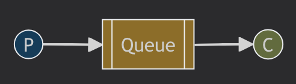

# Spring AMQP Tutorial

This project is a demonstration of using Spring AMQP for communication between a publisher and a consumer using RabbitMQ.

## Prerequisites

- Java 17
- Maven
- RabbitMQ installed with default configurations on localhost

## Project Structure

The project is organized into tutorials. Each tutorial demonstrates different aspects of AMQP communication using Spring.

---

## Tutorial 1: Hello World



This tutorial demonstrates a simple direct communication setup between a publisher and a consumer. 

The publisher will send 5 messages, one every second, to the consumer.

### Running the Tutorial

### Step 1: Build the Project

Before running the project, you need to build it using Maven. Run the following command in the project's root directory:

```bash
./mvnw clean package
```

### Step 2: Running the Sender

To start the sender, run the following command:

```bash
java -jar target/rabbitmq-amqp-tutorials-0.0.1-SNAPSHOT.jar --spring.profiles.active=hello-world,sender
```

### Step 3: Running the Consumer

Next, start the consumer using the following command:

```bash
java -jar target/rabbitmq-amqp-tutorials-0.0.1-SNAPSHOT.jar --spring.profiles.active=hello-world,receiver
```

### Step 4: Verifying Communication

With both the sender and consumer running, you will see messages being sent by the sender and received by the consumer.

---

## About RabbitMQ

RabbitMQ is a widely used messaging software that implements the AMQP (Advanced Message Queuing Protocol). It allows different parts of a software system to communicate asynchronously by sending messages through queues.
